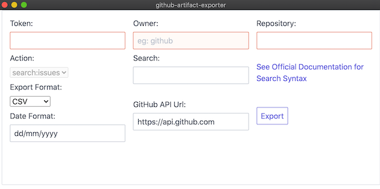

# GitHub Exporter
  



The GitHub Exporter is written in Typescript and provides a set of packages to make exporting artifacts from GitHub easier useful for those migrating information out of github.com

Supported artifacts that you can export are
- Issues (including filtered sub sets)

Supported formats of the export file are
- CSV
- JIRA formatted CSV
- JSON

## Packages

### CLI

[@github/github-exporter-cli](packages/cli)

### Core

[@github/github-exporter-core](packages/core)

### GUI

[@github/github-exporter-gui](packages/gui)

## Getting Started

### Prerequisites
1. This is a [lerna](https://github.com/lerna/lerna) project and will need the lerna CLI.
    - To install lerna globally run `npm install -g lerna`
1. Generate and export a PAT so you can pull from GPR. The PAT will need read packages scope.
    - `export NPM_TOKEN=<PAT>`

### Building The Application

```bash
lerna clean -y
lerna exec npm install
lerna link
lerna bootstrap
# Optional, start the gui to ensure its working
lerna run start
```

## Contributing
We welcome you to contribute to this project! Check out [Open Issues](https://github.com/github/github-artifact-exporter/issues) and our [`CONTRIBUTING.md`](./CONTRIBUTING.md) to jump in.

## License
[MIT](./LICENSE)  
When using the GitHub logos, be sure to follow the [GitHub logo guidelines](https://github.com/logos).

